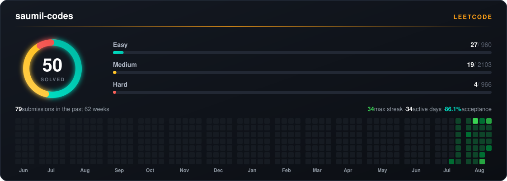

<h1 align="center">Hi, I'm Saumil 👋</h1>

CS undergrad · sharpening C++ and DSA in public · building small things on the side

 

 
<h3 align="center">What I'm working on</h3>

<b>C++ and data structures &amp; algorithms</b> — solving on LeetCode most days, 
building the fundamentals properly rather than fast  
<b>Small front-end projects</b> — <a href="https://github.com/SaumilCodes/deodar-cafe">deodar-cafe</a> · <a href="https://github.com/SaumilCodes/SaumilCodes.github.io">SaumilCodes.github.io</a>

 
<h3 align="center">Tech</h3>

 
<h3 align="center">What I'm working on</h3>

<b>C++ and data structures &amp; algorithms</b> — solving on LeetCode most days, 
building the fundamentals properly rather than fast  
<b>Small front-end projects</b> — <a href="https://github.com/SaumilCodes/deodar-cafe">deodar-cafe</a> · <a href="https://github.com/SaumilCodes/SaumilCodes.github.io">SaumilCodes.github.io</a>

 
<h3 align="center">Tech</h3>

    
  </a>

 

<h3 align="center">What I'm working on</h3>

  <b>C++ and data structures &amp; algorithms</b> — solving on LeetCode most days, 
  building the fundamentals properly rather than fast  
  <b>Small front-end projects</b> — <a href="https://github.com/SaumilCodes/deodar-cafe">deodar-cafe</a> · <a href="https://github.com/SaumilCodes/SaumilCodes.github.io">SaumilCodes.github.io</a>

 

<h3 align="center">Tech</h3>

  
  
  
  

    
  </a>

 

<h3 align="center">What I'm working on</h3>

  <b>C++ and data structures &amp; algorithms</b> — solving on LeetCode most days, 
  building the fundamentals properly rather than fast  
  <b>Small front-end projects</b> — <a href="https://github.com/SaumilCodes/deodar-cafe">deodar-cafe</a> · <a href="https://github.com/SaumilCodes/SaumilCodes.github.io">SaumilCodes.github.io</a>

 

<h3 align="center">Tech</h3>

  
  
  
  

    
  </a>

 

<h3 align="center">What I'm working on</h3>

  <b>C++ and data structures &amp; algorithms</b> — solving on LeetCode most days, 
  building the fundamentals properly rather than fast  
  <b>Small front-end projects</b> — <a href="https://github.com/SaumilCodes/deodar-cafe">deodar-cafe</a> · <a href="https://github.com/SaumilCodes/SaumilCodes.github.io">SaumilCodes.github.io</a>

 

<h3 align="center">Tech</h3>

  
  
  
  

<h1 align="center">Hi, I'm Saumil 👋</h1>

  CS undergrad · sharpening C++ and DSA in public · building small things on the side

  
  
  

 

  

 

<h3 align="center">What I'm working on</h3>

  <b>C++ and data structures &amp; algorithms</b> — solving on LeetCode most days, 
  building the fundamentals properly rather than fast  
  <b>Small front-end projects</b> — <a href="https://github.com/SaumilCodes/deodar-cafe">deodar-cafe</a> · <a href="https://github.com/SaumilCodes/SaumilCodes.github.io">SaumilCodes.github.io</a>

 

<h3 align="center">Tech</h3>

  
  
  
  

